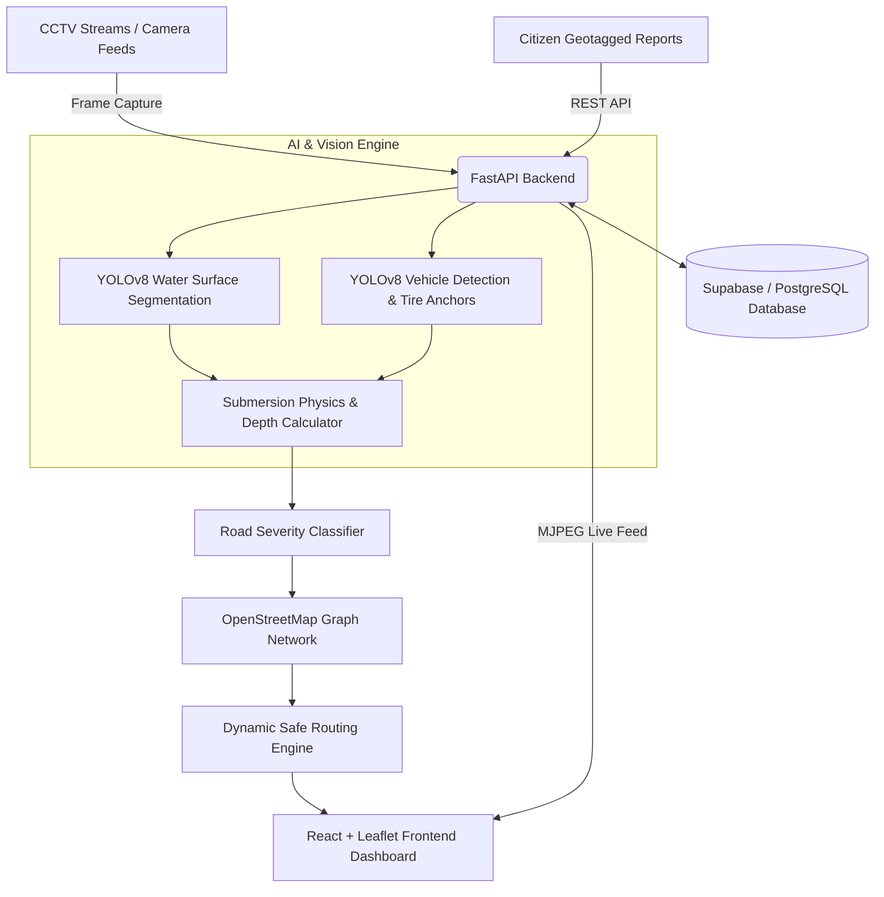

# 🌊 FloodLens — Autonomous Hyperlocal Flood Intelligence & Dynamic Safe Routing

[](https://fastapi.tiangolo.com/)
[](https://reactjs.org/)
[](https://vitejs.dev/)
[](https://ultralytics.com)
[](https://pytorch.org/)
[](https://tailwindcss.com/)
[](https://supabase.com/)

---

## 📌 Overview

**FloodLens** is an end-to-end hyperlocal flood intelligence and urban road accessibility platform. It combines real-time computer vision (dual YOLOv8 water segmentation and vehicle submersion depth inference), municipal CCTV streams, satellite SAR radar sensing, real OpenStreetMap (OSM) road networks, and crowdsourced citizen hazard reports to answer one critical question:

> **"Can I safely reach my destination, and if my route is flooded, what is the best dynamically computed safe alternative?"**

---

## ✨ Key Features

### 1. 🔍 Autonomous Computer Vision & Water Depth Estimation
- **Dual YOLOv8 Model Pipeline**: Water surface polygon segmentation running alongside COCO vehicle bounding box detectors.
- **Tire Submersion Physics**: Estimates physical water depth in centimeters by calculating the intersection of segmented water masks with wheel/chassis anchor points on standard vehicle classes (Cars, SUVs, Buses, Autos, Two-Wheelers).
- **Hazard Classification**: Automatically categorizes water levels into **Safe (< 10 cm)**, **Caution (10–25 cm)**, and **Passage Blocked (> 25 cm)**.

### 2. 🗺️ Dynamic OSM Road Accessibility Engine
- Dynamic OpenStreetMap (OSM) road network parsing.
- Real-time road segment hazard status updates driven by CCTV stream telemetry and verified citizen reports.
- Interactive Leaflet mapping with street-level accessibility overlays (Passable, Warning, Impassable).

### 3. 🚗 Smart Flood-Avoidance Safe Routing
- Multi-modal pathfinding algorithm that factors in distance, road priority, and dynamic flood depth penalties.
- Dynamically re-routes vehicles around inundated zones and waterlogged underpasses in real time.

### 4. 👥 AI-Verified Citizen Hazard Reporting
- Crowd-sourced flood reporting with geotagged image uploads and severity markers.
- Bridges coverage gaps between municipal CCTV sensors for instantaneous field ground-truthing.

### 5. 📡 Real-Time CCTV Live Intelligence Feeds
- Low-latency MJPEG video streaming server with continuous on-the-fly inference and bounding box overlays.

---

## 🏗️ System Architecture



---

## 🛠️ Tech Stack

### **Backend & Machine Learning**
- **Framework**: FastAPI, Uvicorn, Pydantic
- **Computer Vision**: Ultralytics YOLOv8 (Segmentation & Detection), OpenCV, PyTorch, NumPy
- **Spatial / Graph Algorithms**: OSM Network Parser, Dijkstra / Dynamic Routing Graph
- **Database**: Supabase (PostgreSQL)

### **Frontend & User Interface**
- **Framework**: React 18, Vite
- **Styling**: Tailwind CSS, Lucide Icons
- **Mapping**: Leaflet, React-Leaflet
- **State Management**: React Context API

---

## 🚀 Getting Started

### Prerequisites
- Python 3.9+ (CUDA-compatible GPU recommended for real-time inference)
- Node.js 18+ & npm
- Conda (optional, recommended)

---

### 1. Backend Setup

```bash
# Navigate to backend
cd backend

# Create & activate a virtual environment
python -m venv venv
# Windows:
venv\Scripts\activate
# Linux/macOS:
source venv/bin/activate

# Install dependencies
pip install -r requirements.txt

# Configure environment variables
cp .env.example .env
# Fill in your SUPABASE_URL and SUPABASE_KEY in .env

# Run FastAPI server
uvicorn main:app --reload --port 8000
```
Backend API docs will be available at `http://localhost:8000/docs`.

---

### 2. Frontend Setup

```bash
# Navigate to frontend (in a new terminal)
cd frontend

# Install Node modules
npm install

# Configure environment variables (if required)
cp .env.example .env

# Run Vite dev server
npm run dev
```
Frontend will be accessible at `http://localhost:5173`.

---

## 📂 Project Structure

```text
├── backend/
│   ├── main.py                   # FastAPI application & CV inference endpoints
│   ├── requirements.txt          # Python dependencies
│   ├── schema.sql                # Supabase database schema
│   ├── real_roads.json           # Cached OSM road graph dataset
│   └── .env.example              # Sample environment configuration
├── frontend/
│   ├── src/
│   │   ├── components/           # TopNav, Footer, LeafletMap, Modal panels
│   │   ├── context/              # FloodLens global React Context
│   │   ├── pages/                # Landing, LiveIntelligence, RoadAccessibility, SafeRoutes, CitizenHazards, About
│   │   └── data/                 # Road network and mock telemetry data
│   ├── package.json
│   └── vite.config.js
├── models/                       # Custom trained model weights (e.g. water segmentation)
├── scripts/                      # Training & depth inference experiment scripts
├── .gitignore                    # Comprehensive ignore rules
└── README.md
```

---

## 📜 License

Distributed under the MIT License. See `LICENSE` for more information.